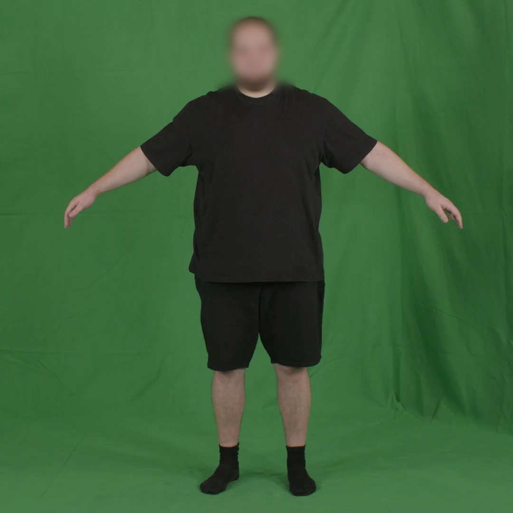
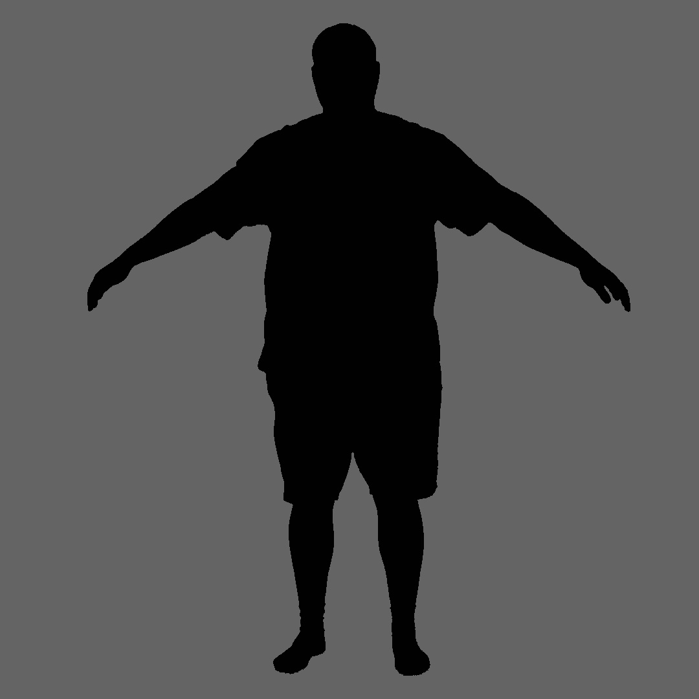
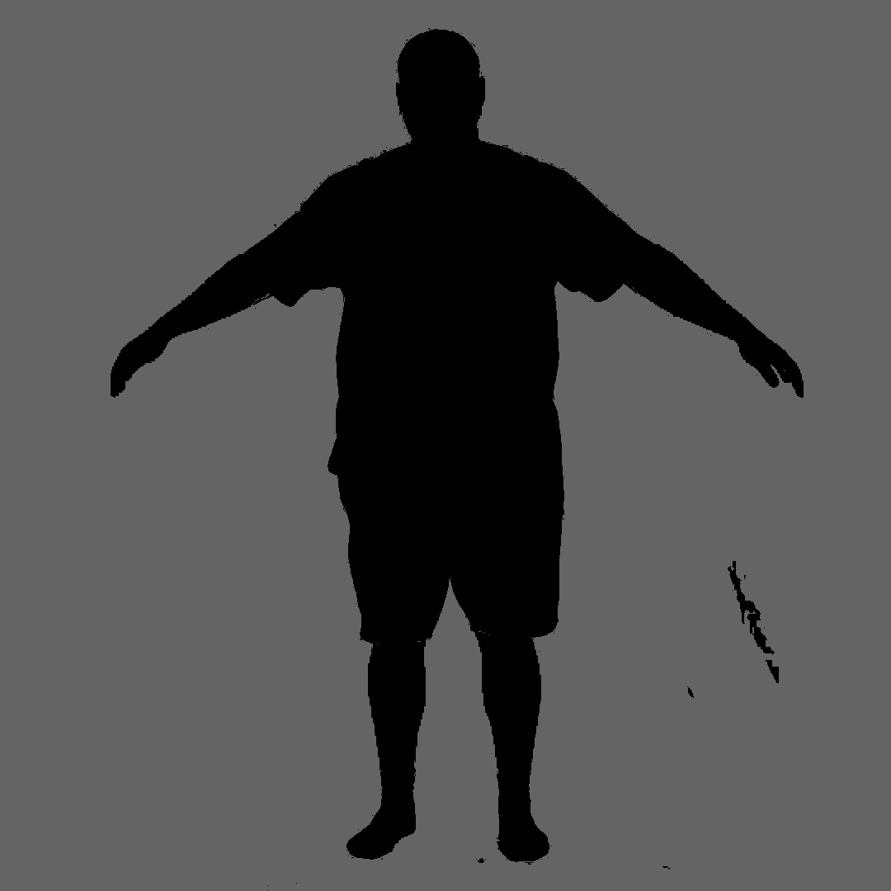
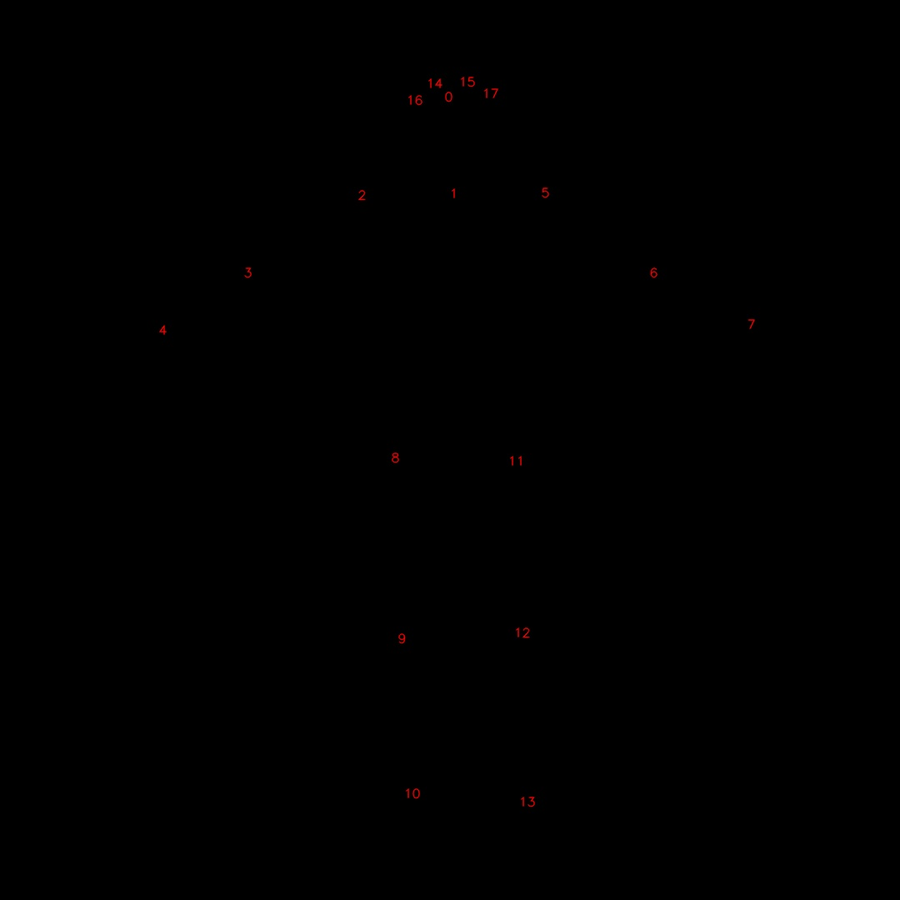

# Video based reconstruction of 3D people models Data Generation

This repository contains code to generate data for [**Video based reconstruction of 3D people models**] (https://github.com/thmoa/videoavatars)

## Installation

To start using this framework clone the repo:
Create a conda environment with python 2.7

```bash
git clone https://github.com/abidaks/videoavatars-data-generation
cd videoavatars-data-generation
pip install -r requireents.txt
```
Once you installed the requirement, run below code to download models
```
cd pose
python wget.py
```

You need to create two conda environments one with python 2.7 and one with python 3.6+
Python 3 to run pose json and masks generation code.

Create a conda environment with python 3+
Once you create new environment you need to install tensorflow requirements

```
conda activate <python 3 environment>
cd pose
pip install -r requireents.txt
```

### Original Image
This image is a screenshoot taken from the dataset video provided by SMPL
<p align="center">

</p>

### Masks Data by SMPL "Video based reconstruction of 3D people models"

<p align="center">

</p>

### Masks Data by this code

<p align="center">

</p>


### Pose Coordinates numbers
I also restructures the pose coordinated and created array as required by "Video based reconstruction of 3D people models"

<p align="center">

</p>

## Usage

The software consists of five parts:

1. `pose/generate_json.py`: to generate json file for each popse in the video
2. `generate_masks.py`: to generate mask images for each pose of video
3. `create_camera.py`: to create the camera pickle file, it is same as videoavatars
4. `2djoints2hdf5.py`: to create the hdf5 file from json based joints files, i did some changes to videoavatars file
5. `masks2hdf5.py`: to create the hdf5 file from masked images we created using generate masks file above, i did some changes to videoavatars file

Starting the scripts will display usage information and options.

## Generating Data commands

These are the list of commands you can use to generate data.
Pose json file generation (activate anaconda python 3 environment you created above)
```
cd pose
python generate_json.py -l=<folder path to save json data> -v=<video file path>
example
python generate_json.py -l=../json_data -v=../video/test.mp4
```

Video to masks generation
```
python generate_masks.py -l=<folder path to save mask data> -v=<video file path>
example
python generate_masks.py -l=./mask_data -v=./video/test.mp4
```

### Activate Anaconda python 2.7
All below commands will run on anaconda python 2.7 environment

Camera pickle file generation
```
python create_camera.py <pickle file location> <video/camera width> <video/camera width>
example
python create_camera.py ./data/camera.pkl 1080 1080
```

Pose joints hdf5 file generation
```
python 2djoints2hdf5.py <folder path to saved json data> <output file location/name>
example
python 2djoints2hdf5.py ./json_data ./data/keypoints.hdf5
```

Masks hdf5 file generation
```
python masks2hdf5.py<folder path to saved mask data> <output file location/name>
example
python masks2hdf5.py ./mask_data ./data/masks.hdf5

```

## Test Dataset

The accompanied dataset can be downloaded here: https://graphics.tu-bs.de/people-snapshot
You can compare your generated files with these dataset to verify your data.
I also added some code to verify your generated data in `testing_code.py` file.


## License

You can use the code as you pleased. :P
